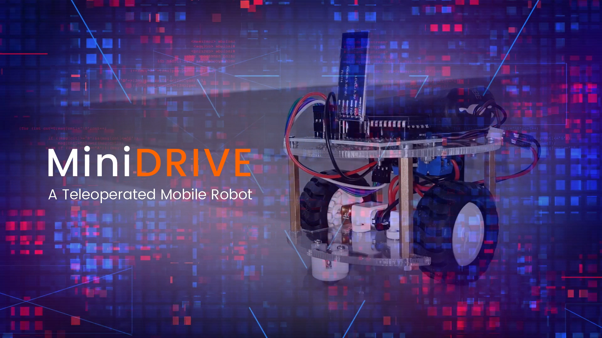

# MiniDRIVE | A Teleoperated Mobile Robot

MiniDRIVE is a teleoperated (remotely controlled) differentially driven mobile robot, which is intended to be controlled by a human or centralized computer and takes no positive action autonomously.

This project uses Bluetooth link to control the robot remotely, and the remote controller can be any personal computing device (PCD) having Bluetooth connectivity (such as smartphone, laptop PC, etc.) that hosts a software application capable of communicating with the robot over a serial communication port (Bluetooth link) and transmitting the control signals remotely to the robot. 

The robot utilizes HC-05 Bluetooth module in order to establish a serial communication between the remote PCD and itself. The task of lower-level control is accomplished by the on-board microcontroller - ATmega16. Based on the command received from the remote PCD, (an ASCII character denoting a particular control signal), the microcontroller generates digital signals that command the motor driver module (L298N) to ultimately drive the motors so as to maneuver the robot as per the direction.

The software applications used to control the robot are listed below:
1. [BT Terminal](https://play.google.com/store/apps/details?id=appinventor.ai_samakbrothers.BT_Terminal)
2. [BT Robot Controller](https://play.google.com/store/apps/details?id=appinventor.ai_samakbrothers.DriveBot_Controller)
3. [PuTTY](https://www.putty.org)
4. [MiniDRIVE GUI](https://github.com/Samak-Twins/MiniDRIVE/blob/master/Software/MiniDrive%20GUI/MiniDRIVE_GUI.pde)

Demonstration video available on [YouTube](https://www.youtube.com/watch?v=Rbxxlpjfh9E).
